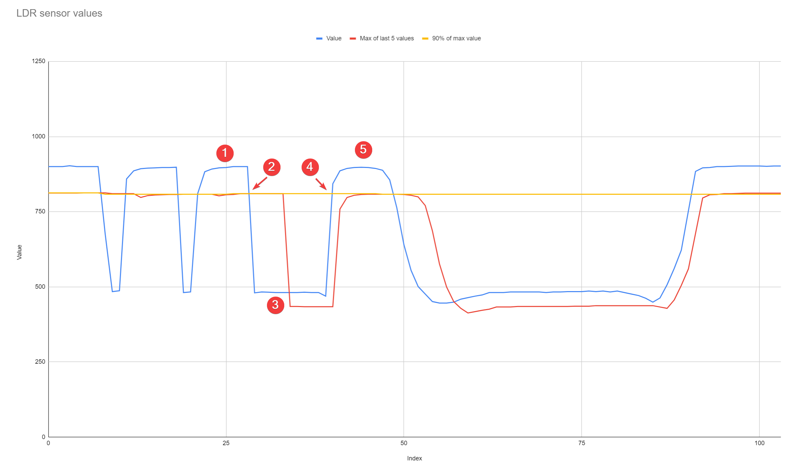
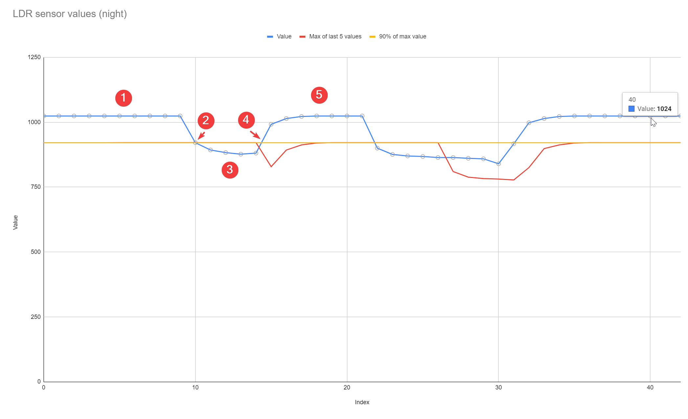
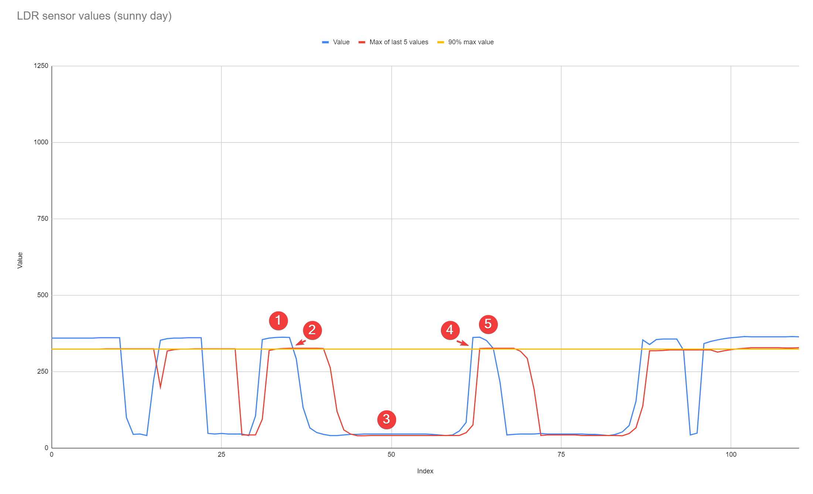

# KRVKBuzón
##  👨‍💻 UNDER DEVELOPMENT ##
### Receive an alert via Telegram when you receive a new postal mail (yes, there are still people who receive letters).  ###
__NOTICE__: This system does not filter advertising or propaganda.

## Example data ##

Tests have been carried out in 3 contexts. One on any cloudy day, another at night (having a streetlight nearby), and another in broad daylight.
As you can see, it is not always possible to determine a fixed value from which to determine whether the door is open/closed, so it is necessary to do a small calculation.
In this case, it is decided to use an offset from which to make the decision, for example, 90% of the maximum value of the last 5 values.
When the current value falls below said offset, it is determined that the door has just been opened.
When the value is greater than the offset again, it is determined that the door has just closed.

1️⃣ Closed door value  
2️⃣ Point where read value gets below of 90% of the 5 previous maximum values. We are going to take this point as **the door has been opened**  
3️⃣ Open door value  
4️⃣ Point where read value gets over again of 90% of the previous maximum values. We are going to take this point as **the door has been closed**  
5️⃣ Closed door value

### Regular tests ###

| Index | Value | Max of last 5 values | 90% of max value |
|-------|-------|-----------------------|------------------|
|   0   |  900  |         812           |       812,7      |
|   1   |  900  |         812           |       812,7      |
|   2   |  900  |         812           |       812,7      |
|   3   |  903  |         812           |       812,7      |
|   4   |  900  |         812           |       812,7      |
|   5   |  900  |        812,7          |       812,7      |
|   6   |  900  |        812,7          |       812,7      |
|   7   |  900  |        812,7          |       812,7      |
|   8   |  675  |        812,7          |       808,2      |
|   9   |  484  |         810           |       808,2      |
|  10   |  487  |         810           |       808,2      |
|  11   |  859  |         810           |       808,2      |
|  12   |  886  |         810           |       808,2      |
|  13   |  893  |        797,4          |       808,2      |
|  14   |  895  |        803,7          |       808,2      |
|  15   |  896  |        805,5          |       808,2      |
|  16   |  897  |        806,4          |       808,2      |
|  17   |  897  |        807,3          |       808,2      |
|  18   |  898  |        807,3          |       808,2      |
|  19   |  481  |        808,2          |       808,2      |
|  20   |  483  |        808,2          |       808,2      |
|  ...  |  ...  |        ...            |        ...       |

### Night values ###

| Index | Value | Max of last 5 values |
|-------|-------|-----------------------|
|   0   |  1024 |         921           |
|   1   |  1024 |         921           |
|   2   |  1024 |         921           |
|   3   |  1024 |         921           |
|   4   |  1024 |         921           |
|   5   |  1024 |        921,6          |
|   6   |  1024 |        921,6          |
|   7   |  1024 |        921,6          |
|   8   |  1024 |        921,6          |
|   9   |  1024 |        921,6          |
|  10   |  921  |        921,6          |
|  11   |  893  |        921,6          |
|  12   |  883  |        921,6          |
|  13   |  877  |        921,6          |
|  14   |  881  |        921,6          |
|  15   |  992  |        828,9          |
|  16   | 1014  |        892,8          |
|  17   | 1022  |        912,6          |
|  18   | 1024  |        919,8          |
|  19   | 1024  |        921,6          |
|  20   | 1024  |        921,6          |
|  ...  |  ...  |         ...           |

### Sunny values ###

| Index | Value | Max of last 5 values |
|-------|-------|-----------------------|
|   0   |  360  |         324           |
|   1   |  360  |         324           |
|   2   |  360  |         324           |
|   3   |  360  |         324           |
|   4   |  360  |         324           |
|   5   |  360  |         324           |
|   6   |  360  |         324           |
|   7   |  361  |         324           |
|   8   |  361  |        324,9          |
|   9   |  361  |        324,9          |
|  10   |  361  |        324,9          |
|  11   |  100  |        324,9          |
|  12   |   45  |        324,9          |
|  13   |   46  |        324,9          |
|  14   |   41  |        324,9          |
|  15   |  222  |        324,9          |
|  16   |  353  |        199,8          |
|  17   |  358  |        317,7          |
|  18   |  360  |        322,2          |
|  19   |  360  |         324           |
|  20   |  361  |         324           |
|  ...  |  ...  |         ...           |

